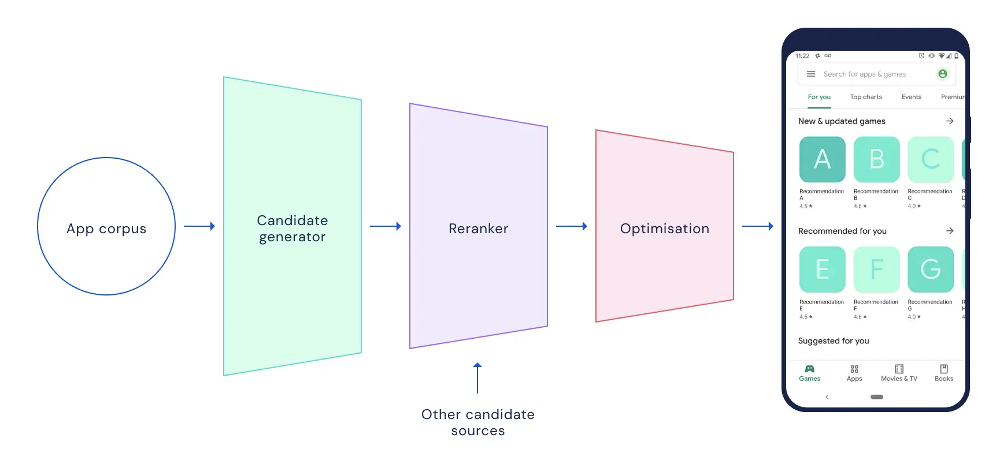

# recommender-system

# Recommendations: What and Why?
Online services usually provide thousands, millions or even billions of items like products, video clips, movies, musics, news, articles, blog posts, advertisements, etc. For example, the Google Play Store provides millions of apps and YouTube provides billions of videos.
However, users prefer to see a handful shortlist of likely items instead of struggling with the full corpora. They usually can search or filter the list to find the best handful items, but sometimes they even don't know what they really want (e.g. a birthday gift). In a physical store an expert seller would help in this case by useful recommendations. So, why not in an online store?!
A recommendation system can retrieve, filter and recommend best personalized results for the user - results which the user is likely to buy. So it is one of the major requirements of modern businesses in order to increase their conversion rate. On September 21, 2009, Netflix gave a grand prize of $1,000,000 to a team which bested Netflix's own algorithm for predicting ratings by 10.06%.

A recommendation system ia a system that gives a query (context) which is what we know about the liking list, and filter the corpus (full catalog of items) to a shortlist of candidates (items, documents). A query (context) can be a user id, user's geographical location or user's history of previous purchases and the resulting candidates can be some new items that we guess are interesting for the user.
The query can also be an item id, it’s image or its textual description and the candidates can be some similar or related items from the corpus.

</img>

# Recommendation stages (tasks)
In practice, dealing with a large corpus and filter it to a shortlist is an intractable and inefficient task. So practical recommender systems has two (or three) filtering phases:

1. Retrieval (Candidate Generation)
2. Ranking (Scoring)
3. Re-ranking or optimization or ...

# Candidate Generation Overview
Candidate generation is the first stage of recommendation. Given a query, the system generates a set of relevant candidates.
content-based filtering: Uses similarity between items to recommend items similar to what the user likes.
collaborative filtering: Uses similarities between queries and items simultaneously to provide recommendations.

# Representation of a query or a candidate

A query or a candidate has lots of different features. For example a query can be constructed by these features:
- user_id
- user_previous_history
- user_job
- etc.

And a candidate can have features like:
- item_description
- item_image
- item_price
- posted_time
- etc.

These obviouse features can be numerical variables, categorical variables, bitmaps or raw texts. However, these low-level features are not enough and we should extract some more abstract latent features from these obvious features to represent the query or the candidate as a numerical high-dimensional vector - known as Embedding Vector.

# Matrix Factorization
Matrix Factorization (MF) is a classic collaborative filtering method to learn some latent factors (latent features) from user_id, item_id and rating features and represent users and items by latent (embedding) vectors.

# Matrix Factorization problem!
Matrix Factorization method only uses user_id and candidate_id features collaboratively to learn the latent features. In fact it doesn't care about other side-features like candidate_description, price, user_comment, etc.
To involve side-features as well as ids while learning latent features (embeddings), we can use deep neural network (DNN) architectures like softmax or two-tower neural models.
To involve side-features as well as ids while learning latent features (embeddings), we can use deep neural network (DNN) architectures like softmax or two-tower neural models.

# Two Tower Neural Network
The idea behind the two-tower model architecture is that there are two separate neural networks, called towers. You can interpret these two towers as separate models one representing the users, known as the query tower, and one representing the items, known as the candidate tower. During training, each tower learns to transform an arbitrary set of input features into vectors known as embeddings. The dimension of these embeddings must be the same for both the users and the items as finally the similarity between them is measured using the dot product.

